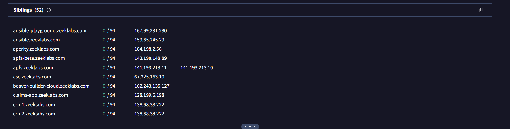
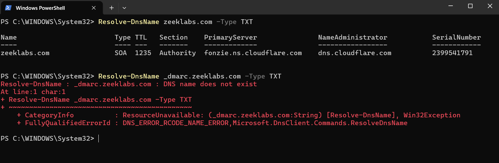

# 🔍 Phishing / Sextortion Campaign Analysis — OSINT & Threat Intelligence

> **Investigação prática de e-mail malicioso, OSINT e rastreamento de infraestrutura criminosa**  
> Analista: Nicollas Cavalcante Souza  
> Data do incidente: 04/03/2026  
> Status da infraestrutura: **Ativa durante a análise**

---

## 🎯 Objetivo

Este projeto documenta uma investigação OSINT completa de uma campanha de sextortion/phishing, partindo do e-mail recebido até o rastreamento da infraestrutura e do fluxo financeiro em Bitcoin.

O objetivo é entender:
- Como o spoofing foi possível
- Como a infraestrutura foi utilizada
- Como os fundos se movimentam
- Onde ocorre o ponto de quebra de anonimato

---

## 📖 O Golpe — Sextortion Scam


- Alegação falsa de comprometimento total
- Pressão psicológica e urgência
- Pedido de pagamento (~600 USD em BTC)

➡️ Engenharia social em massa — sem evidência real de invasão

---

## 🛠️ Ferramentas Utilizadas

| Ferramenta | Uso |
|---|---|
| VirusTotal | Reputação e relações |
| AbuseIPDB | Histórico de abuso |
| Shodan | Serviços expostos |
| URLScan | Análise HTTP |
| Censys | Certificados TLS |
| Arkham | Fluxo Bitcoin |
| Blockchain Explorer | Transações |

---

## 🔎 Investigação

### 📧 Headers do E-mail


- SPF: FAIL  
- DKIM: NONE  
- DMARC: FAIL  

Return-Path ≠ From → spoofing confirmado

➡️ Domínio NÃO comprometido

---

### 🌐 Infraestrutura


IP: 67.205.157.219  
ASN: DigitalOcean  

➡️ VPS descartável para envio SMTP

---

### 🌍 Domínio




Domínio: zeeklabs.com  

---

### 🔐 Segurança DNS



- SPF: inexistente  
- DMARC: inexistente  
- DKIM: inexistente  

➡️ Vulnerável a spoofing

---

### 🔒 TLS / Censys


Issuers:
- Google Trust
- Cloudflare
- Let's Encrypt
- Amazon

➡️ Uso legítimo (sem reuse malicioso)

---

## ₿ Rastreamento Bitcoin

### Carteira inicial


1LW9aVXFeEpGaqDaugFj6UoYfPBWvsLHPv

---

### Entrada via Exchange


---

### Split (Fan-out)


---

## 🔀 Path A — Gate.io


➡️ Fluxo direto para exchange

---

## 🔀 Path B — KuCoin


➡️ Multi-hop + obfuscação

---

## 🧠 Padrões Identificados

- Email spoofing  
- VPS descartável  
- Abuso de domínio legítimo  
- Peel chain  
- Fan-out  
- Cash-out em exchange  

---

## 📊 Classificação

| Técnica | Status |
|--------|--------|
| Peel chain | ✔️ |
| Fan-out | ✔️ |
| Mixer real | ❌ |
| Exchange exit | ✔️ |

---

## 📊 Linha do Tempo

- 2024 → Atividade inicial  
- 2025 → Certificados ativos  
- 27/02/2026 → Abuse report  
- 04/03/2026 → E-mail recebido  
- 2026 → Análise conduzida  

---

## 🧠 Conclusão

- Infraestrutura não permite atribuição
- Fluxo financeiro leva a exchanges (KYC)

➡️ Único ponto viável de investigação real

---

## 🛡️ Recomendações

**Usuários:**
- Não pagar
- Ativar MFA
- Senhas únicas

**Blue Team:**
- Bloquear IP / ASN
- Monitorar SPF fail + DMARC fail
- Blacklist de carteiras

---

## 📁 Estrutura

```
evidence/
01_email_raw.png
02_header_analysis.png
...
23_Censys_cert.names_Issuer.png
```

---

## ⚠️ Disclaimer

Análise realizada com OSINT para fins educacionais.
