# 🔍 Phishing / Sextortion Campaign Analysis — OSINT & Threat Intelligence

> **Investigação prática de e-mail malicioso, OSINT e rastreamento de infraestrutura criminosa**
> Analista: Nicollas Cavalcante Souza
> Data do incidente: 15/03/2026
> Status da infraestrutura: **Ativa durante a análise**

---

## 🎯 Objetivo

Este projeto documenta uma investigação OSINT completa de uma campanha de **sextortion/phishing**, partindo do e-mail recebido até o rastreamento da infraestrutura e do fluxo financeiro em Bitcoin.

O objetivo é entender:

- Como o spoofing foi possível
- Como a infraestrutura foi utilizada
- Como os fundos se movimentam
- Onde ocorre o ponto de quebra de anonimato

> 📎 **Nota:** Esta é a segunda campanha investigada com perfil similar. A primeira, documentada em projeto separado, utilizava a infraestrutura `brighterfuture.net` / IP `164.92.68.246`. Ambas compartilham o mesmo provedor de VPS (**DigitalOcean, AS14061**). O que pode indicar padrão operacional do mesmo ator ou grupo. Ver seção [Conexão entre campanhas](#-conexão-entre-campanhas).

---

## 📖 O Golpe — Sextortion Scam

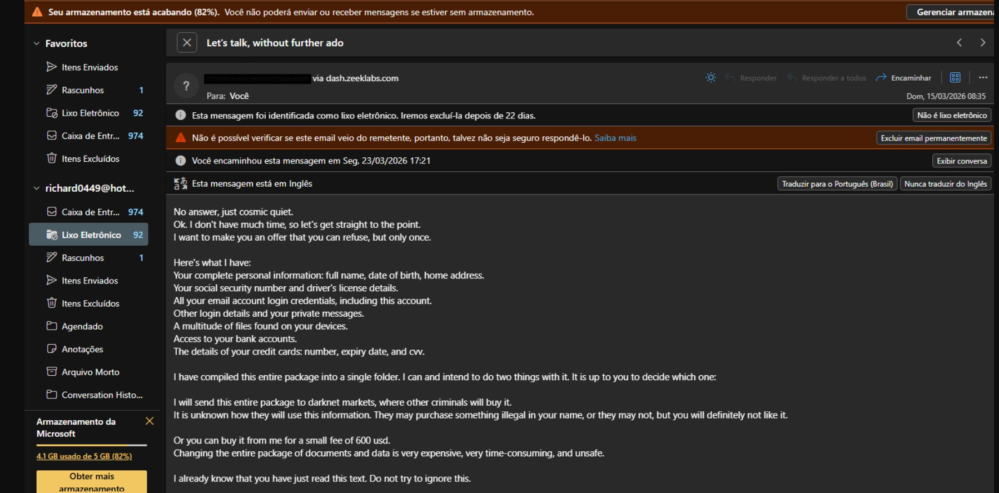

O e-mail seguia o padrão clássico de **sextortion em massa**:

- Alegação falsa de comprometimento total (dados pessoais, senhas, câmera)
- Pressão psicológica e urgência (prazo de 1 dia)
- Pedido de pagamento de **~USD 600 em Bitcoin**
- **Nenhuma das informações alegadas é real** — é engenharia social pura

O primeiro passo foi não pagar. O segundo foi investigar.

---

## 🛠️ Ferramentas Utilizadas

| Ferramenta | Uso |
|---|---|
| **VirusTotal** | Reputação de IP, Passive DNS, Relations |
| **AbuseIPDB** | Histórico de abuse reports |
| **Shodan** | Portas abertas e serviços expostos |
| **URLScan.io** | Análise de comportamento HTTP do domínio |
| **Censys** | Certificados TLS e infraestrutura |
| **Arkham** | Fluxo e grafo Bitcoin |
| **Blockchain Explorer** | Rastreamento de transações |

---

## 🔎 Investigação

### 1. Ponto de partida — Headers do E-mail

Os headers revelaram imediatamente que o e-mail era fraudulento:

```
From:        richard****@hotmail.com       ← endereço spoofado
Return-Path: hexane@dash.zeeklabs.com      ← origem real exposta
X-Sender-IP: 67.205.157.219
SPF:         FAIL
DKIM:        NONE
DMARC:       FAIL
```

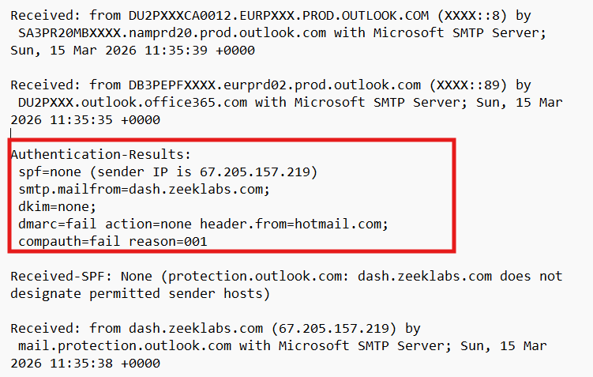

O que cada resultado revela:

- **SPF FAIL** — o IP de envio não está autorizado pelo domínio declarado
- **DKIM NONE** — e-mail sem assinatura digital, não autenticado
- **DMARC FAIL** — falha combinada de autenticação → spoofing confirmado
- **Return-Path ≠ From** — endereço real do atacante exposto no cabeçalho

➡️ **Domínio zeeklabs.com NÃO foi comprometido.** O atacante abusou de uma misconfiguration de DNS (ausência de SPF/DMARC) para impersonar o domínio via SMTP sem controle sobre ele.

---

### 2. Investigando o IP — 67.205.157.219

**VirusTotal**

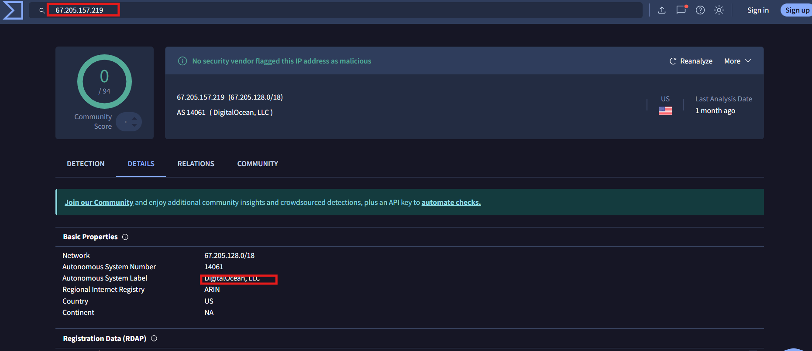

- Baixa detecção → infraestrutura rotacionada para evasão de blacklists
- Passive DNS (aba Relations) revelou domínios associados ao IP

**AbuseIPDB**

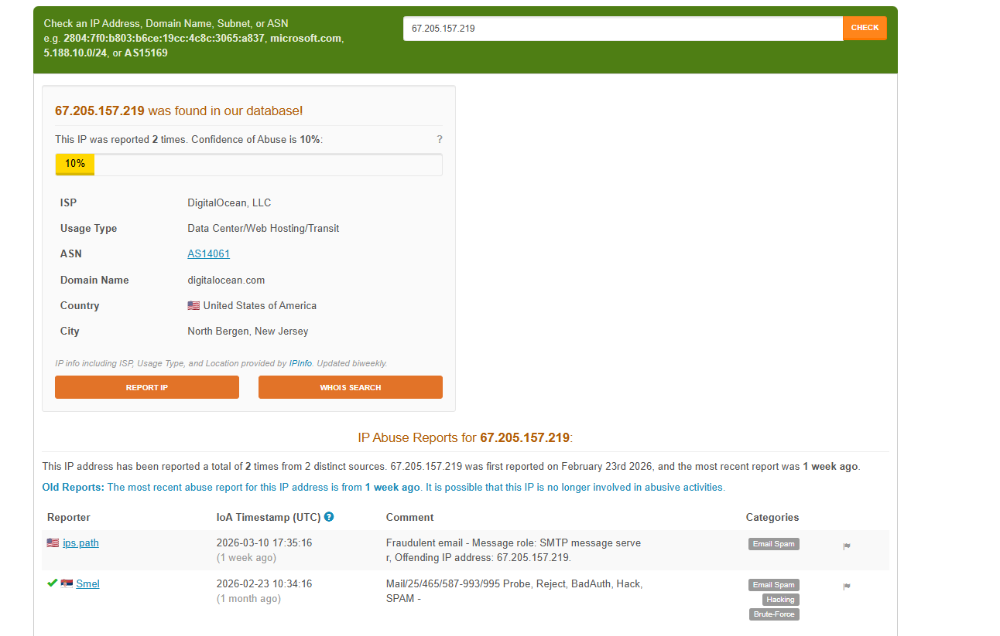

- Reports de abuso registrados
- Categorias: Email Spam, Spoofing, Phishing

**Shodan**

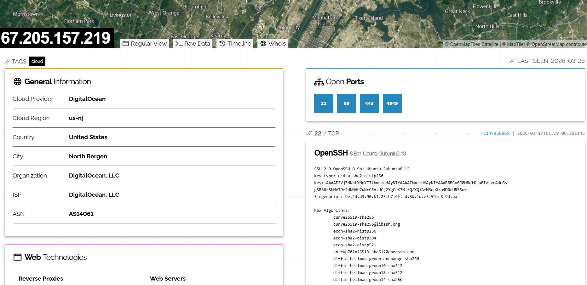

| Porta | Serviço | Observação |
|---|---|---|
| 22 | SSH — OpenSSH | Acesso remoto ativo |
| 80 | HTTP — nginx | Servidor web ativo |
| 443 | HTTPS | Ativo |
| 4949 | Monitoring | Serviço de monitoramento exposto |

**Hipótese de cadeia de ataque:**

```
Aluga VPS DigitalOcean (AS14061)
            ↓
Configura servidor SMTP (zeeklabs.com como identidade)
            ↓
Dispara spam em massa (SPF FAIL, sem DMARC)
            ↓
Vítima recebe → paga Bitcoin
            ↓
Fragmentação em camadas → Exchange → saque
```

---

### 3. Investigando o Domínio — zeeklabs.com

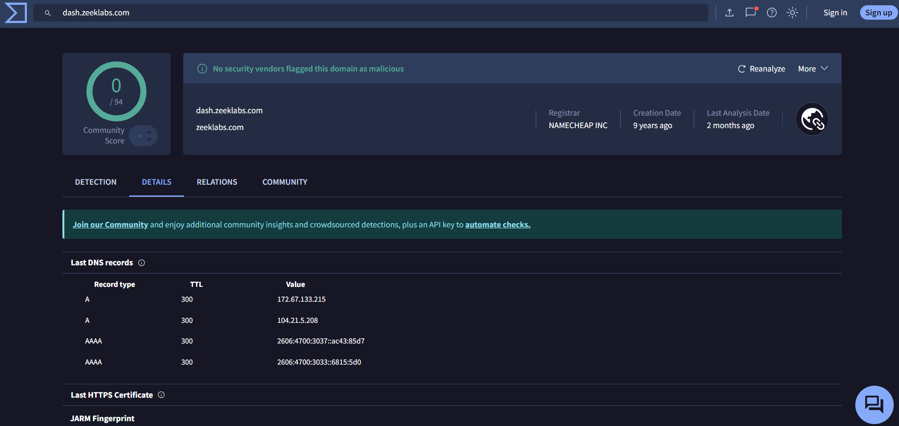
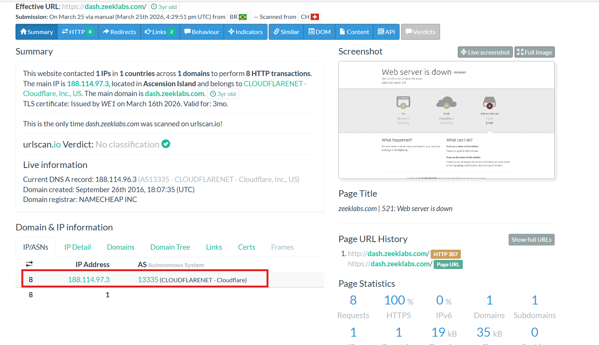

- DNS Provider: **Cloudflare**
- **SPF: inexistente**
- **DMARC: inexistente**
- **DKIM: não configurado**

➡️ Domínio legítimo com **misconfiguration crítica de segurança de e-mail**, tornando-o vulnerável a spoofing sem qualquer comprometimento direto.

**Análise TLS (Censys)**

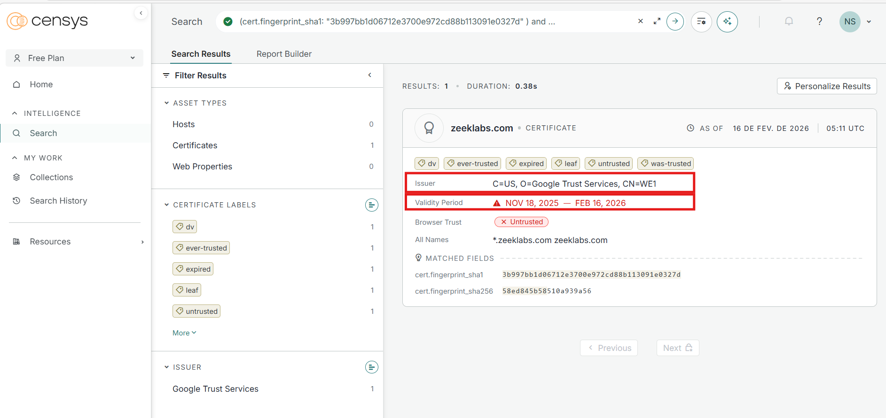
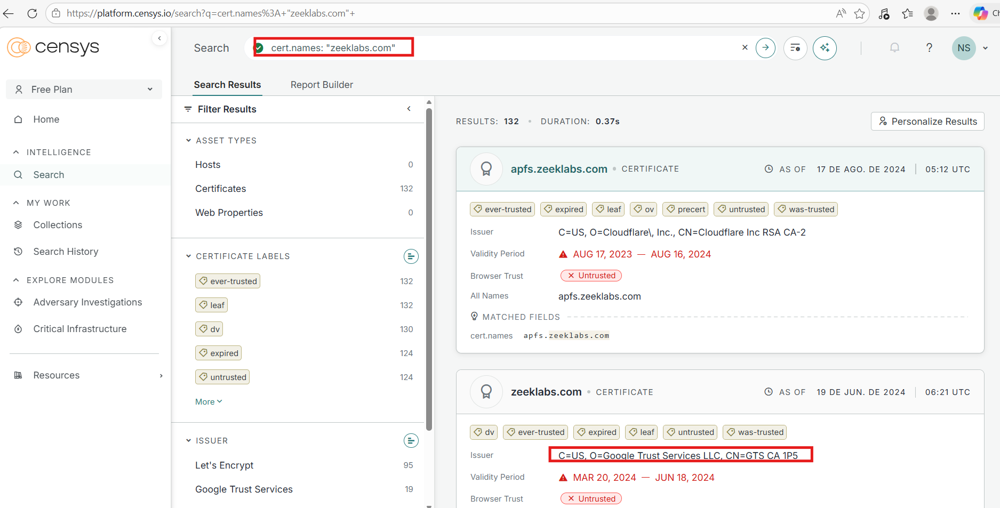

| Issuer | Observação |
|---|---|
| Google Trust Services | Uso legítimo de CDN |
| Cloudflare Inc | Consistente com DNS/proxy Cloudflare |
| Let's Encrypt | Rotação automática padrão |
| Amazon | Uso legítimo de cloud |

- Certificados de curta duração e com wildcard (`*.zeeklabs.com`)
- **Nenhum reuso malicioso identificado** nos certificados
- Comportamento consistente com infraestrutura cloud normal

---

### 4. Rastreamento Bitcoin

**Carteira primária (attacker-controlled):**
`1LW9aVXFeEpGaqDaugFj6UoYfPBWvsLHPv`

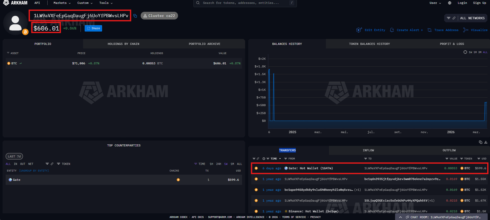

- Saldo: ~0.00853 BTC (~600 USD)
- Entradas: carteira hot wallet da exchange Gate.io + carteiras antigas

---

### 5. Fluxo de Lavagem — Fan-out + Peel Chain

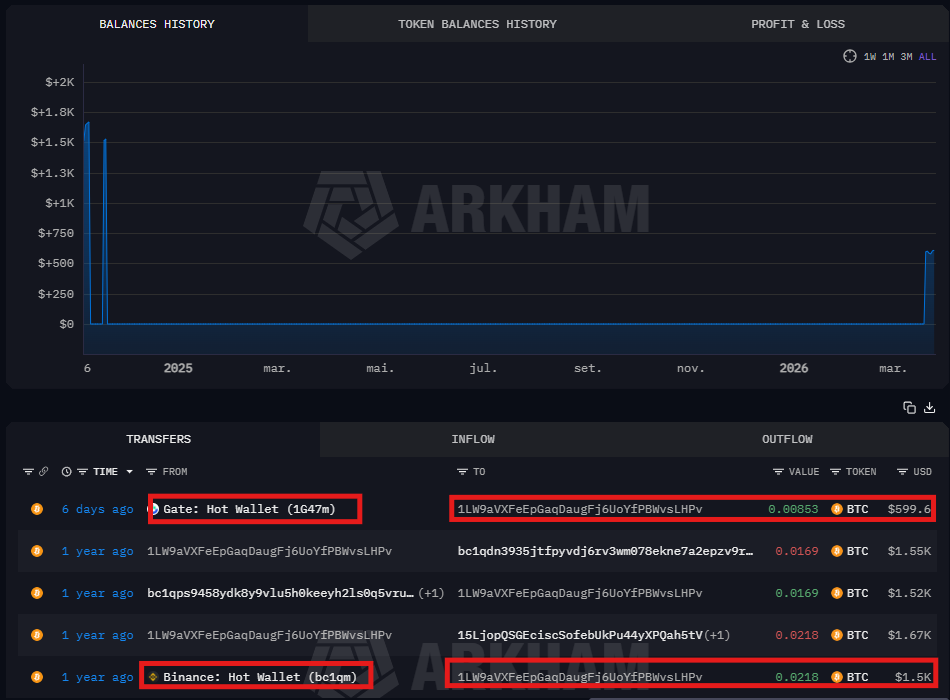
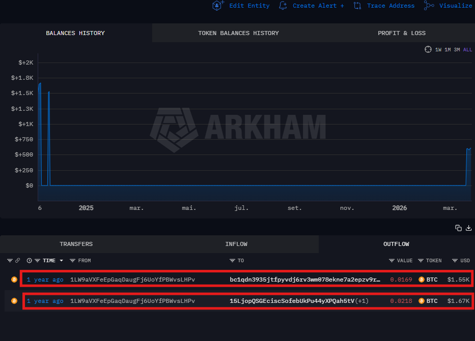

Após receber os fundos, a carteira distribui para dois caminhos paralelos:

---

#### 🔀 Path A — Gate.io (Agregação direta)

```
1PZ4sWYF...
  → bc1qdn3935...
    → bc1q0kq7...
      → 15tvZEg89... (Gate.io hot wallet)
```

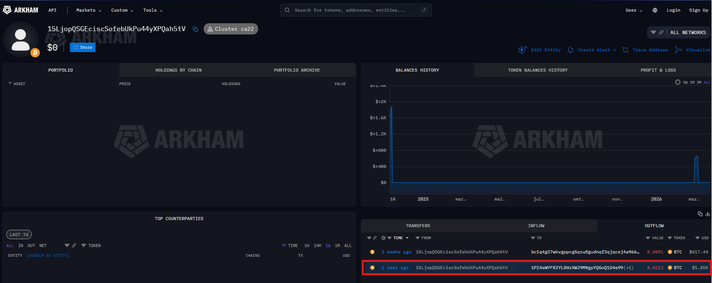
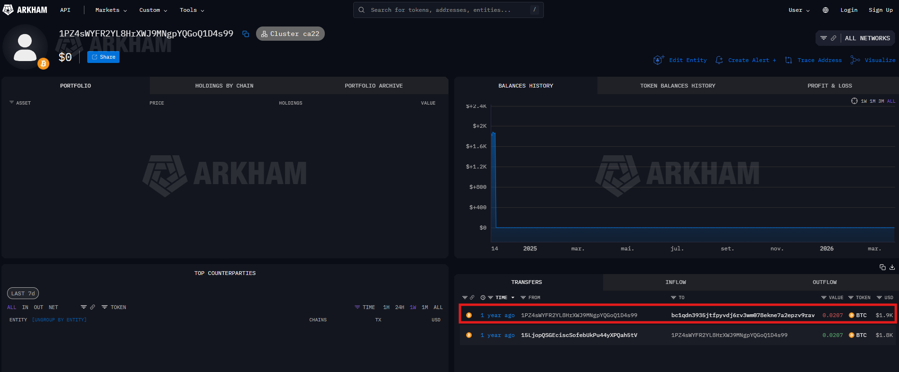
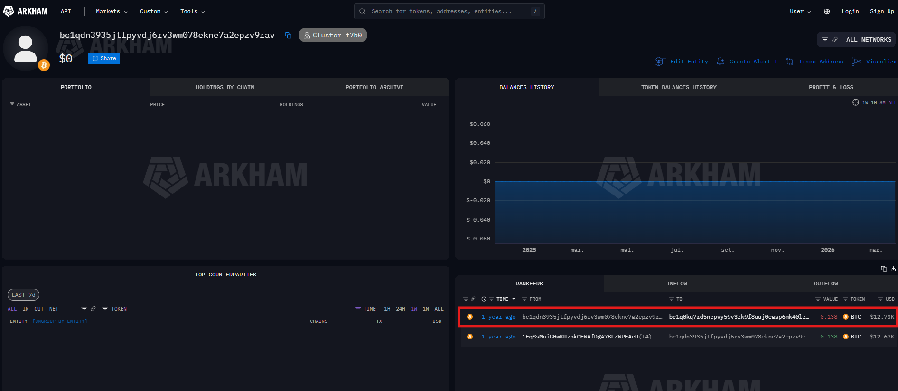
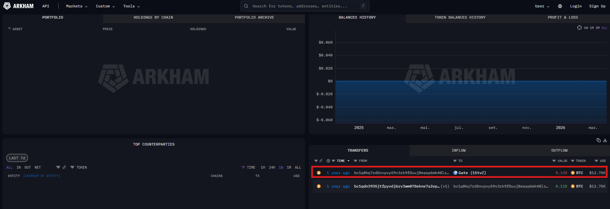

**Comportamento:** agregação de fundos → saída direta para exchange centralizada.

---

#### 🔀 Path B — KuCoin (Multi-hop com obfuscação)

```
bc1q4g37...
  → bc1qcpwh...
    → bc1qn0k7...
      → 3Cb2BhN...
        → bc1q9wvy... (KuCoin hot wallet)
```

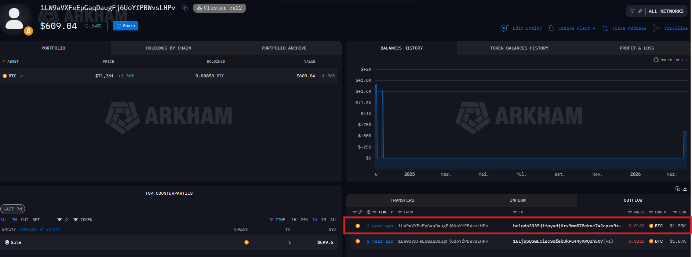
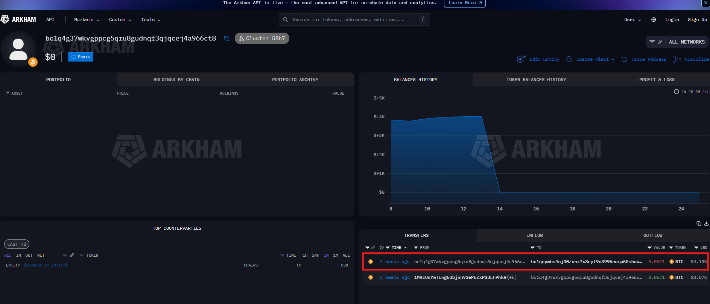
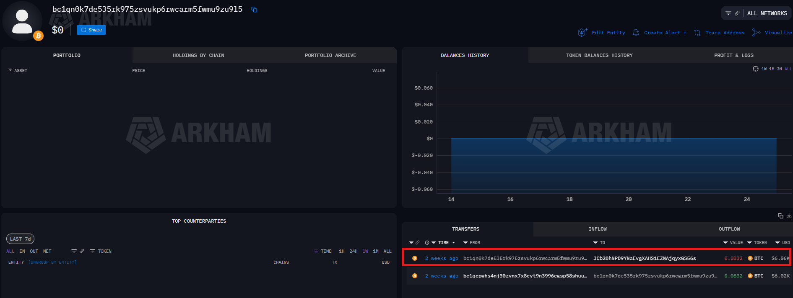
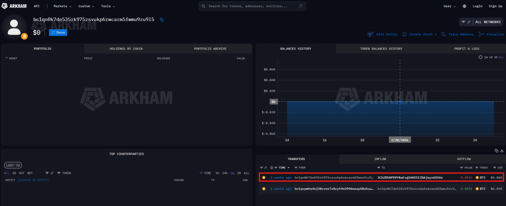
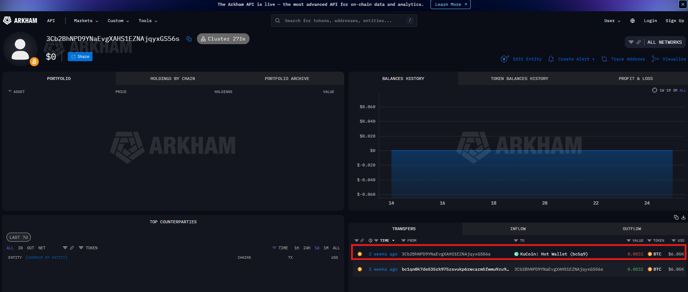

**Comportamento:** multi-hop + fragmentação de fundos simulando mixing → saída para exchange centralizada.

---

## 🔗 Conexão entre Campanhas

Esta investigação é a segunda de uma série de campanhas com perfil similar analisadas de forma independente. A tabela abaixo compara as duas:

| Indicador | Campanha 1 (Caso Anterior) | Campanha 2 (Este Caso) |
|---|---|---|
| **IP** | 164.92.68.246 | 67.205.157.219 |
| **ASN** | AS14061 — DigitalOcean | AS14061 — DigitalOcean |
| **Domínio abusado** | brighterfuture.net | zeeklabs.com |
| **Subdomain SMTP** | api.brighterfuture.net | dash.zeeklabs.com |
| **SPF** | none | FAIL |
| **DMARC** | FAIL | FAIL |
| **Bitcoin exit** | Exchange (peel chain extenso) | Gate.io + KuCoin |
| **Técnica BTC** | Peel chain + SegWit migration | Fan-out + peel chain |
| **Infraestrutura** | VPS descartável | VPS descartável |
| **Banco exposto** | MySQL 3306 (porta aberta) | Não identificado |

**Padrões comuns entre as campanhas:**

- ✅ Uso do mesmo provedor de VPS (DigitalOcean / AS14061)
- ✅ Domínios legítimos abusados via misconfiguration de DNS
- ✅ SMTP configurado em subdomínio como identidade de envio
- ✅ SPF e DMARC ausentes ou falhos como vetor de spoofing
- ✅ Bitcoin com técnicas de obfuscação em camadas
- ✅ Cash-out via exchanges centralizadas com KYC (Gate.io, KuCoin)

> ⚠️ **Nota de atribuição:** A sobreposição de ASN não é suficiente para confirmar o mesmo ator (DigitalOcean é amplamente utilizado por múltiplos agentes). Porém, a combinação de TTPs idênticos, mesma estrutura SMTP e padrão de abuso de domínio é consistente com **o mesmo playbook operacional** — seja do mesmo grupo ou de um kit/playbook compartilhado.

---

## 🧠 Padrões e Táticas Identificados

| Técnica | Descrição |
|---|---|
| **Email Spoofing** | Abuso de domínio sem SPF/DMARC para impersonation |
| **VPS Descartável** | Infraestrutura de baixo custo e fácil rotação |
| **Abuso de domínio legítimo** | Sem comprometimento — apenas misconfiguration |
| **Peel Chain** | Fragmentação progressiva de BTC para dificultar rastreamento |
| **Fan-out** | Divisão dos fundos em múltiplos caminhos paralelos |
| **Exchange cash-out** | Saída em plataformas KYC (Gate.io, KuCoin) |

---

## 📊 Classificação da Campanha

| Técnica Bitcoin | Status |
|---|---|
| Peel chain | ✅ |
| Fan-out | ✅ |
| Mixer real | ❌ (apenas obfuscação por camadas) |
| Exchange exit (KYC) | ✅ |

| Atributo | Avaliação |
|---|---|
| Tipo | Sextortion em massa |
| Targeting | Não-direcionado (vítimas genéricas) |
| Sofisticação | Média-baixa (foco em engenharia social) |
| Atribuição via infraestrutura | **BAIXA** |
| Valor do rastreamento financeiro | **ALTO** |

---

## 🔑 Insight Principal

Os fundos convergem consistentemente para exchanges centralizadas com KYC:

- **Gate.io** (Path A)
- **KuCoin** (Path B)

➡️ Estas exchanges representam o **único vetor viável de atribuição real**, condicionado a cooperação via ordem judicial ou requisição formal de law enforcement.

---

## 📊 Linha do Tempo

```
15/03/2026  → E-mail de sextortion recebido
              SPF FAIL + DMARC FAIL confirmados nos headers
              IP 67.205.157.219 identificado (DigitalOcean AS14061)
              Carteira Bitcoin 1LW9aVXFeEpGaqDaugFj6UoYfPBWvsLHPv identificada
              Análise conduzida — infraestrutura ativa
```

---

## 🧠 Conclusão

O que parecia um golpe comum revelou uma operação estruturada e com paralelos diretos a uma campanha anterior investigada:

- **Infraestrutura baseada em VPS descartável** (DigitalOcean recorrente)
- **Spoofing viabilizado por misconfiguration** — sem comprometimento real do domínio
- **Obfuscação Bitcoin em camadas** — fan-out + peel chain
- **Cash-out em exchanges KYC** — único ponto real de investigação
- **Playbook operacional idêntico** ao caso anterior — fortemente sugestivo de reutilização de infraestrutura ou de técnicas de um mesmo ator

A investigação chegou até onde as ferramentas públicas permitem. O próximo passo exigiria ferramentas de blockchain forensics profissionais (Chainalysis, CipherTrace) ou dados KYC das exchanges via ordem judicial.

---

## 📣 Como Reportar

Se você recebeu um e-mail similar:

| Canal | Link | O que reportar |
|---|---|---|
| **AbuseIPDB** | https://www.abuseipdb.com | IP do remetente |
| **FBI IC3** | https://www.ic3.gov | Crime completo com evidências |
| **DigitalOcean Abuse** | abuse@digitalocean.com | IP de origem |
| **Cloudflare Abuse** | https://www.cloudflare.com/abuse | Domínio zeeklabs.com |

---

## 🛡️ Recomendações

**Para usuários:**

- **Nunca pagar** — as informações são falsas
- Ativar **MFA** em todas as contas críticas
- Usar **senhas únicas** por serviço via gerenciador de senhas

**Para analistas / blue team:**

- Bloquear IP `67.205.157.219` e avaliar o range `67.205.128.0/17`
- Blacklist de domínios: `zeeklabs.com`, `dash.zeeklabs.com`
- Monitorar e-mails com **SPF FAIL + DMARC FAIL** originados de ASNs de datacenter (AS14061)
- Adicionar carteiras Bitcoin identificadas em feeds de threat intelligence
- Regras de detecção disponíveis em [DETECTIONS.md](DETECTIONS.md), conversíveis para qualquer SIEM via [Uncoder.IO](https://tdm.socprime.com/uncoder-ai/translate)

---

## 📁 Estrutura do Repositório

```
sextortion-analysis/
├── README.md
├── DETECTIONS.md
├── iocs.txt
├── email_redacted.eml
└── evidence/
    ├── 01_email_raw.png
    ├── 02_header_analysis.png
    ├── 03_virustotal_ip.png
    ├── 04_abuseipdb.png
    ├── 05_shodan.png
    ├── 06_virustotal_domain.png
    ├── 07_urlscan.png
    ├── 08_dns_spf-dmarc.png
    ├── 09_tls_cert.png
    ├── 10_subdomains.png
    ├── 11_wallet_main.png
    ├── 12_wallet_inflow_gate.png
    ├── 13_wallet_split.png
    ├── 14_tx_15L_to_1PZ4.png
    ├── 15_tx_1PZ4_to_bc1qdn.png
    ├── 16_tx_bc1qdn_to_bc1q0kq7.png
    ├── 17_tx_bc1q0kq7_to_Gate.png
    ├── 18_tx_15L_bc1q4g.png
    ├── 19_tx_bc1q4g_to_bc1qcp.png
    ├── 20_tx_bc1qcp_to_bc1qn0k.png
    ├── 21_tx_bc1qn0k_to_3Cb2B.png
    ├── 22_tx_3Cb2B_to_KuCoin.png
    └── 23_Censys_cert.names_Issuer.png
```

---

## ⚠️ Disclaimer

Esta análise foi conduzida exclusivamente com ferramentas públicas de OSINT e threat intelligence para fins educacionais. Nenhum sistema foi acessado ou explorado. O objetivo é documentar TTPs de campanhas de sextortion e contribuir com a comunidade de segurança da informação.
